# Modern webb- och apputveckling med AI

  

Den här sidan samlar materialet till studiecirkeln **Modern webb- och apputveckling med AI**, framtagen av Medialabbet (verksamhet inom Friskvårdsklubben) tillsammans med Bottennappet i Väst.

Studiecirkeln bedrivs genom samarbete mellan **Bottennappet i Vöst** och **Folkuniversitetet**

Målet är att deltagare – oavsett tidigare erfarenhet – steg för steg ska kunna:

- skapa **en första egen hemsida** och publicera den gratis på GitHub Pages  
- bygga en enkel **webbapp** som visar och hanterar data i webbläsaren  
- förstå grunderna i **frontend, backend och API:er**  
- börja använda **AI-verktyg** som stöd i utvecklingsarbetet  

Studiecirkeln är praktisk och bygger på “lär genom att göra”, i lugn takt med mycket utrymme för frågor.

---

## Upplägg: modulpaket

Materialet är uppdelat i fristående paket. Du kan gå igenom allt i ordning, eller använda enstaka paket som stöd i andra grupper/kurser.

### Paket 1 – Gör din första hemsida

Fokus: komma igång snabbt och se din första sida **live på webben**.

Du får bland annat lära dig:

- skapa GitHub-konto och repo  
- aktivera **GitHub Pages**  
- grunderna i **HTML och CSS**  
- lite enkel **JavaScript** för menyer och små effekter  

Slutmålet är en enkel, personlig eller föreningsrelaterad hemsida som du kan bygga vidare på.

Se: **“Paket 1 – Gör din första hemsida”** i menyn.

---

### Paket 2 – Bygg en enkel webbapp

Fokus: gå från “sida” till **webbapp**.

Du får bland annat lära dig:

- hur **JavaScript i webbläsaren** kan hålla ordning på en lista med data  
- hur du bygger en enkel **aktivitetslista** (lägga till poster, visa dem på sidan)  
- vad **frontend, backend och API** betyder i praktiken  
- en första titt på att hämta data från ett **API** med `fetch()` och **JSON**  

Slutmålet är en enkel aktivitetslista som känns mer som ett program än en statisk sida.

Se: **“Paket 2 – Bygg en enkel webbapp”** i menyn.

---

### Kommande paket – planering, Svelte/SvelteKit och AI

Materialet kommer att byggas ut med fler paket, t.ex.:

- **Paket 3 – Modern frontend med Svelte/SvelteKit**  
  Bygga mer strukturerade webbappar med moderna verktyg.

- **Paket 4 – Planera ett utvecklingsprojekt & använda AI**  
  Grunder i projektplanering, versionshantering och hur AI kan hjälpa till i kodning, dokumentation och felsökning.

När dessa paket är klara dyker de upp i menyn, precis som Paket 1 och 2.

---

## Hur du kan använda materialet

- Som **stöd i studiecirkeln** – kursledare kan följa modulerna direkt.  
- Som **självstudier** – välj ett paket, läs igenom, följ stegen och bygg något eget.  
- Som **referens** – slå upp begrepp, exempel och videolänkar när du fastnar.

Om du är med i Medialabbet, Friskvårdsklubben eller Bottennappet i Väst kan du också:

- ställa frågor i den gemensamma chatt-servern (se menyn “Chatt-server”)  
- dela länkar till dina GitHub Pages-sidor och små projekt för feedback.

Välkommen att utforska och bygga vidare i din egen takt!
