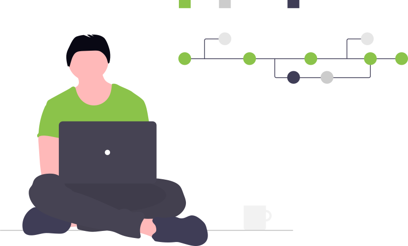

# 1.1 Din första hemsida med GitHub Pages

  

## Mål

Efter den här modulen ska du kunna:

- skapa ett konto på GitHub  
- logga in på GitHub  
- skapa en egen kopia av en färdig hemsidemall (fork)  
- aktivera GitHub Pages och hitta adressen till din hemsida  
- göra enkla ändringar direkt i webbläsaren och se dem på din sida  

Fokus är att få upp **en första enkel sida på internet** –  
inte att lära sig all Git-teori ännu.

---

## Viktigt om upplägget (läs detta först)

Instruktionerna för kursen finns **här i studiecirkelns repo**.  
Själva hemsidan arbetar du med i **ett separat repo** som du skapar själv.

👉 Du kommer därför ofta att ha **två flikar öppna**:
- en flik med instruktionerna (den här sidan)
- en flik med ditt eget hemside-repo

Om du tappar bort dig:  
**kom alltid tillbaka hit**.

---

## Smakprov – Git Explained in 100 Seconds (Fireship)

En snabb överblick av vad Git är:

- https://www.youtube.com/watch?v=hwP7WQkmECE

Du behöver inte förstå allt nu.  
Se det som en förhandskänsla.

---

## Varför Git och GitHub (kortfattat)

Vi går inte på djupet här, men några grundidéer:

- **Git** är ett system för versionshantering:
  - sparar historik  
  - gör det möjligt att ångra misstag  

- **GitHub** är en tjänst på internet där:
  - du lagrar din kod  
  - kommer åt den var som helst  
  - kan publicera enkla sidor gratis med **GitHub Pages**

Vi återkommer till Git mer ordentligt senare i kursen.

---

## Steg 1 – Skapa konto eller logga in på GitHub

### Om du inte har ett konto
1. Gå till https://github.com  
2. Klicka på **Sign up**  
3. Skapa ett gratiskonto:
   - e-postadress  
   - lösenord  
   - användarnamn  
4. Bekräfta via e-post  

När du är klar och inloggad ser du din **GitHub-startsida**.

---

### Om du redan har ett konto
1. Gå till https://github.com/login  
2. Logga in med ditt användarnamn och lösenord  

När du är inloggad kan du fortsätta till nästa steg.

---

## Steg 2 – Skapa din egen kopia av hemsidemallen (fork)

Nu ska du skapa **din egen version** av hemsidan som du kommer att arbeta vidare med under kursen.

1. Öppna följande länk i en **ny flik**:  
   https://github.com/FVK-Medialabbet/first-website-template

2. Klicka på knappen **Fork** uppe till höger

3. Välj:
   - ditt eget GitHub-konto
   - behåll samma namn eller ändra om du vill

4. Klicka **Create fork**

Nu har du fått **en egen kopia av hemsidan** i ditt GitHub-konto.

👉 Gå tillbaka till studiecirkelns instruktioner när detta är klart.

---

## Steg 3 – Slå på GitHub Pages

Nu ska vi göra så att din hemsida syns på internet.

1. I ditt hemside-repo, klicka på **Settings**  
2. Klicka på **Pages** i menyn till vänster  
3. Under **Source**:
   - välj **GitHub Actions**  
     (eller `main` + root om den vyn visas)
4. Inställningen sparas automatiskt

Efter en kort stund visas en länk, till exempel:

> Your site is live at  
> https://ditt-namn.github.io/first-website-template/

Klicka på länken – nu har du en **publicerad hemsida** 🎉

---

## Steg 4 – Gör en ändring på sidan

Nu provar vi hur det känns att uppdatera sidan.

1. Klicka på filen **`index.html`** i ditt repo  
2. Klicka på **pennan** (Edit this file)  
3. Ändra texten, till exempel rubriken  
4. Scrolla ned och klicka **Commit changes**

Vänta några sekunder och:
- ladda om webbadressen 🔄  
- se hur sidan uppdateras

👉 Tänk på **Commit changes** som din nya **spara-knapp**.

---

## Om något inte syns direkt

Det är normalt.

- vänta upp till någon minut  
- ladda om sidan 🔄  
- kontrollera att du sparade ändringen  

---

## Vad händer i nästa steg?

Nästa lektion börjar vi:

- titta på **HTML-taggar** (rubriker, stycken, länkar)  
- förstå hur webbläsaren läser koden  
- bygga vidare på samma hemsida  

Du kan redan nu:
- skriva lite mer text på startsidan  
- spara ändringar med **Commit changes**  
- titta på fliken **Commits** för att se historiken  

---

## Kom ihåg

Du kommer inte lära dig allt här.  
Målet är att **komma igång och förstå grunderna**.

När du vill göra något som inte står i instruktionerna:
- sök information själv  
- läs dokumentation  
- fråga – gärna även AI  

Men:
- använd AI som **stöd**  
- se till att du **förstår vad som händer**

Att kunna ta reda på mer själv är en viktig del av kursen.
