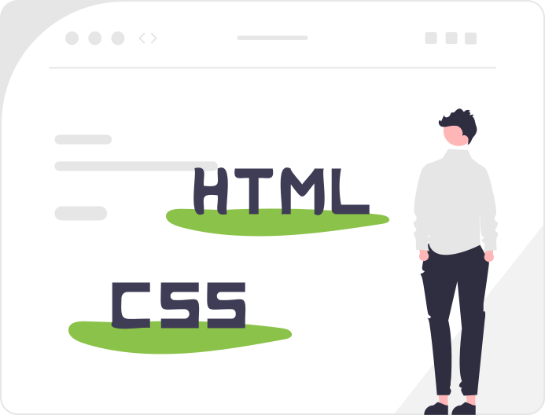

# 1.2 HTML och CSS – bygg vidare på din första sida

<p align="left">
  
</p>

<p><strong>Obs!</strong> Alla länkar i detta material är klickbara HTML-länkar.
Externa länkar öppnas i ny flik.</p>

I den här modulen bygger vi vidare på den sida du skapade i <strong>1.1</strong> med GitHub Pages.

Nu går vi från “bara text” till att:

- förstå grunderna i <strong>HTML</strong> (struktur och innehåll)
- se hur <strong>CSS</strong> styr utseendet
- göra din sida lite mer lik en riktig <strong>personlig / förenings‑hemsida</strong>

---

## Smakprov – HTML in 100 seconds (Fireship)

Som en kort, kul introduktion rekommenderar vi videon:

<a href="https://youtu.be/ok-plXXHlWw?si=8M8fBaKfVOgmlNRz"
   target="_blank"
   rel="noopener noreferrer">
  HTML in 100 seconds – Fireship
</a>

---

## Mål

Efter den här modulen ska du:

- känna igen de vanligaste HTML‑taggarna:
  - <code>&lt;html&gt;</code>, <code>&lt;head&gt;</code>, <code>&lt;body&gt;</code>
  - rubriker: <code>&lt;h1&gt;</code>–<code>&lt;h3&gt;</code>
  - stycken: <code>&lt;p&gt;</code>
  - länkar: <code>&lt;a href="..."&gt;</code>
  - listor: <code>&lt;ul&gt;</code>, <code>&lt;li&gt;</code>
- veta var du kan skriva <strong>CSS</strong> för att ändra utseendet
- kunna:
  - ändra rubriker och text
  - lägga till en länk
  - ändra någon enkel stil (t.ex. färg eller typsnitt)

Fokus är fortfarande <strong>att våga prova</strong>, inte att skriva perfekt kod.

---

## Upplägg på träffen

Föreslaget upplägg för en träff (ca 2 × 45 min med paus):

### Del 1 – Från text till HTML

Kort prat i helgrupp:

- Vi utgår från sidan du gjorde i <strong>1.1</strong>.
- Kursledaren visar ett enkelt exempel på en HTML‑sida, t.ex.:

```html
<!DOCTYPE html>
<html lang="sv">
  <head>
    <meta charset="UTF-8" />
    <title>Min första hemsida</title>
    <style>
      body {
        font-family: Arial, sans-serif;
        background-color: #111;
        color: #f1f1f1;
      }
    </style>
  </head>
  <body>
    <h1>Min första hemsida</h1>
    <p>Hej! Jag heter ... och detta är min första enkla sida.</p>
  </body>
</html>
```

Sedan gör ni tillsammans en av två varianter:

<strong>Variant A – skapa <code>index.html</code></strong>  
- I GitHub: <strong>Add file → Create new file</strong>  
- Filnamn: <code>index.html</code>  
- Klistra in HTML‑exemplet ovan  
- Spara med <strong>Commit changes</strong>  
- GitHub Pages använder nu <code>index.html</code> som startsida

<strong>Variant B – färdig sida</strong>  
- Kursledaren har redan förberett ett <code>index.html</code>  
- Fokus ligger direkt på att ändra innehåll och utseende

---

### Del 2 – Gemensamma ändringar

Gör några saker <strong>tillsammans</strong>:

1. Ändra texten i <code>&lt;h1&gt;</code>  
2. Ändra texten i <code>&lt;p&gt;</code>  
3. Lägg till en extra paragraf (<code>&lt;p&gt;</code>)

Visa sedan hur små CSS‑ändringar fungerar:

```css
h1 {
  text-align: center;
}
```

Efter varje ändring:
- spara (commit)
- vänta en stund
- ladda om GitHub Pages‑adressen 🔄

---

## Övningar för deltagarna

### 1. Presentera dig själv eller din förening

- en huvudrubrik (<code>&lt;h1&gt;</code>)  
- minst två stycken (<code>&lt;p&gt;</code>)

---

### 2. Skapa en lista

```html
<h2>Aktiviteter jag gillar</h2>
<ul>
  <li>Promenader</li>
  <li>Spela bordtennis</li>
  <li>Koda enkla hemsidor</li>
</ul>
```

---

### 3. Lägg till en länk

```html
<p>
  Besök gärna
  <a href="https://www.fvk-media.se"
     target="_blank"
     rel="noopener noreferrer">
     FVK Media
  </a>
  för mer information.
</p>
```

---

### 4. Testa mer CSS

```css
body {
  font-family: Arial, sans-serif;
  background-color: #202020;
  color: #f5f5f5;
}

h1 {
  color: #a7dca5;
}
```

---

## Mellan träffarna (frivillig fördjupning)

<a href="https://youtube.com/playlist?list=PLuc3JXzcNTZSYxj8Q32SIbR7wt7fgi7of"
   target="_blank"
   rel="noopener noreferrer">
  HTML och CSS – nybörjarguide på svenska (spellista)
</a>

---

## Tips till kursledare

- Påminn deltagarna om att inget “går sönder”
- Visa att det är okej att göra fel
- Fokus är trygghet och förståelse, inte perfektion
