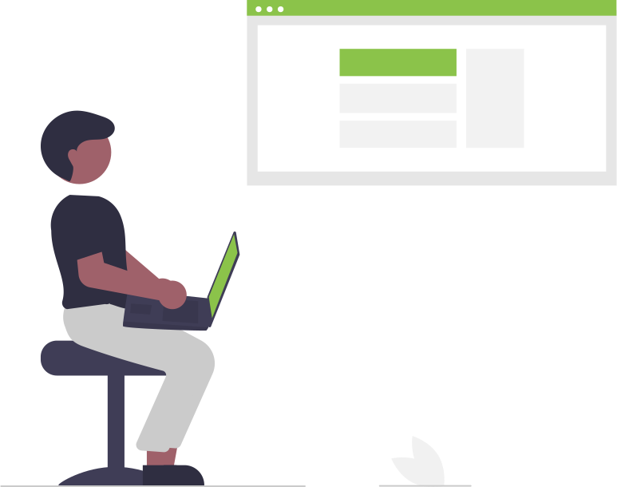

# Paket 2 – Bygg en enkel webbapp med JavaScript och API

  

I det här paketet går vi från **statisk hemsida** till en **enkel webbapp**.

Det betyder att sidan inte bara visar text du själv har skrivit, utan också kan:

- visa data som kommer från **JavaScript-kod**
- hämta information från ett **API** (en webbtjänst)
- reagera på användaren (t.ex. filtrera eller lägga till saker i en lista)

Vi håller det fortfarande på grundnivå, med fokus på:

- att **förstå principen** frontend ↔ API (backend)  
- att **våga läsa och ändra JavaScript-kod**  

Paket 2 består av tre moduler och en övning:

- **2.1 Vad är en webbapp? – frontend, backend och API**  
- **2.2 JavaScript i webbläsaren – data och listor**  
- **2.3 Hämta data från ett API – fetch och JSON**  
- **2.4 Övning & självstudier – aktivitetslista som webbapp**

I senare paket kommer du kunna bygga mer avancerade appar med t.ex. **SvelteKit**.  
Här handlar det om att få grundkänslan för hur JavaScript kan göra din sida mer “levande”.
