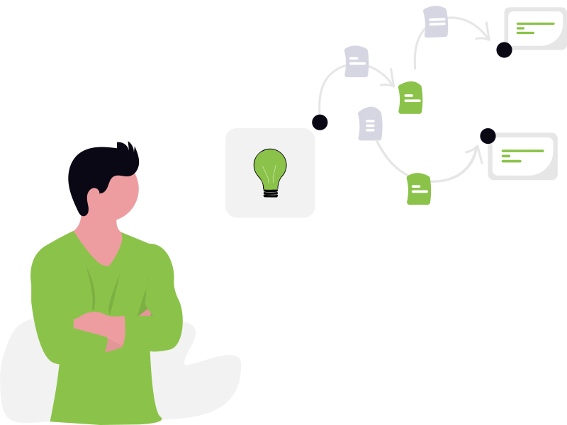

# 3.1 Från idé till problemdefinition och målbild

  

## Mål

Efter den här modulen ska du:

- kunna beskriva **vad** ditt projekt handlar om på några meningar
- kunna formulera **vilket problem** du försöker lösa och för vem
- ha en första **målbild**: hur ser det ut när projektet ”är bra nog”?

## Innehåll

### Idé och bakgrund

- Vad vill du bygga?
  - exempel: aktivitetslista, enkel bokningssida, projektsida, blogg
- Varför är det viktigt eller användbart?
  - för dig själv, din förening eller en målgrupp

### Problemdefinition

Försök svara på:

- Vilket problem har målgruppen idag?
- Vad är det som är krångligt, otydligt eller saknas?
- Hur skulle du förklara problemet för någon på 1 minut?

En enkel mall kan vara:

> ”[Målgrupp] har problemet att [problem].  
> Det gör att [konsekvens].  
> Vår webb/app ska hjälpa dem att [lösning i en mening].”

### Målbild

Beskriv hur det ser ut när projektet fungerar ”tillräckligt bra”:

- Vad ska användaren kunna göra?
- Hur ska det kännas att använda lösningen?
- Vad skulle få dig att säga: ”Det här var värt tiden”?

Här pratar vi om **MVP** (Minimum Viable Product) utan att använda ordet om vi inte vill:  
en första version som är liten men användbar.

## Förslag på självstudier

- Skriv ett kort dokument (5–10 meningar) där du:
  - presenterar idén
  - beskriver målgruppen
  - formulerar problem och målbild med egen text
- Om du vill:
  - testa att använda AI (t.ex. ChatGPT) för att förbättra texten utan att ändra innehållet – jämför före/efter och välj den version du tycker känns tydligast.
